# Qsine User Guide

## Overview
Qsine is designed to help users identify potential allergens in food by analyzing images, barcodes, or text. Whether you're traveling, trying new foods, or just want certainty about a product, Qsine provides quick and accurate allergen detection.

## Installation

### Mobile App
1. Visit the App Store (iOS) or Google Play Store (Android). (Process is invite only at the moment.)
2. Search for **Qsine**.
3. Download and install the app.
4. Open the app.
5. Follow the on-screen instructions to start using Qsine.

## Features

### Image Scanning
Qsine can analyze food images to identify potential allergens. Simply take a clear photo of your food item, and Qsine will process it to detect allergens.

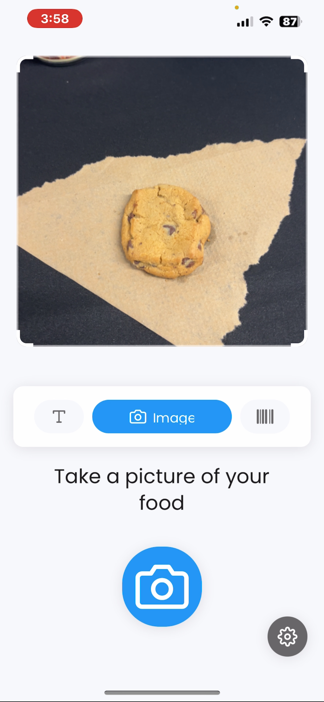
*The main image scanning interface allows you to capture food items*

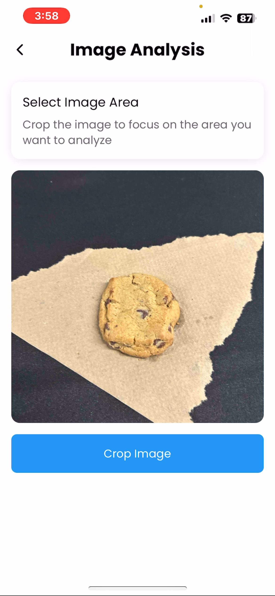
*Results showing detected allergens in the scanned food item*

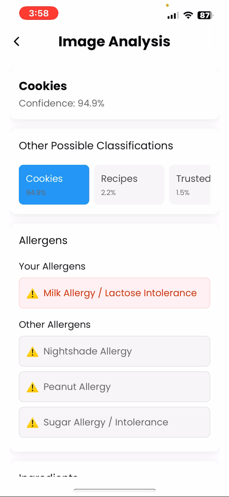
*Detailed view of allergen information for the scanned item*

### Barcode Scanning
For packaged foods, use the barcode scanner to quickly identify product ingredients and allergens.

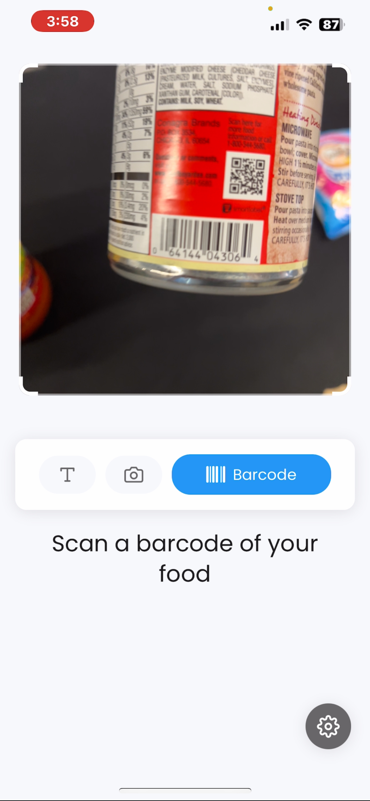
*The barcode scanner interface for packaged foods*

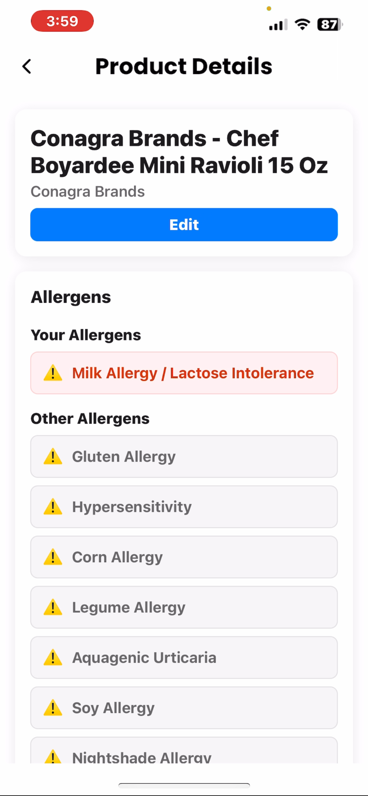
*Results showing product information and allergen details*

### Text Input
You can also manually enter text to search for allergen information.

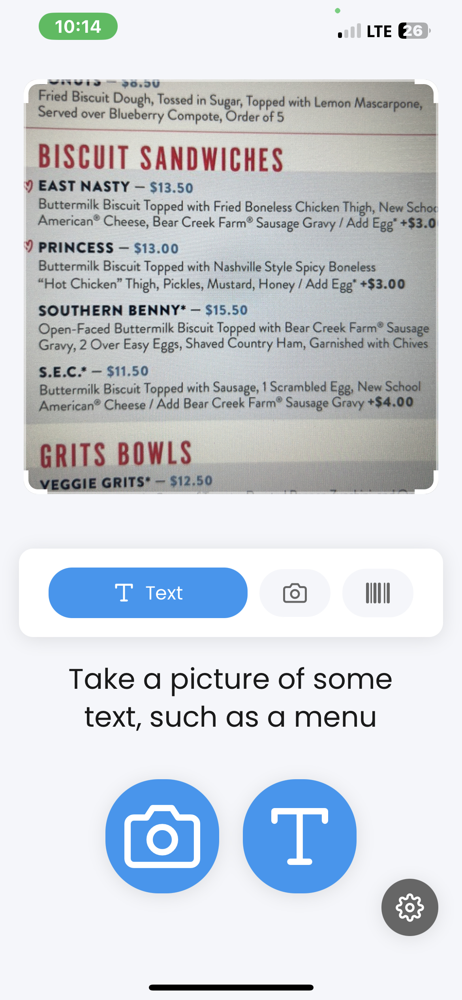
*The text input interface for manual searches*

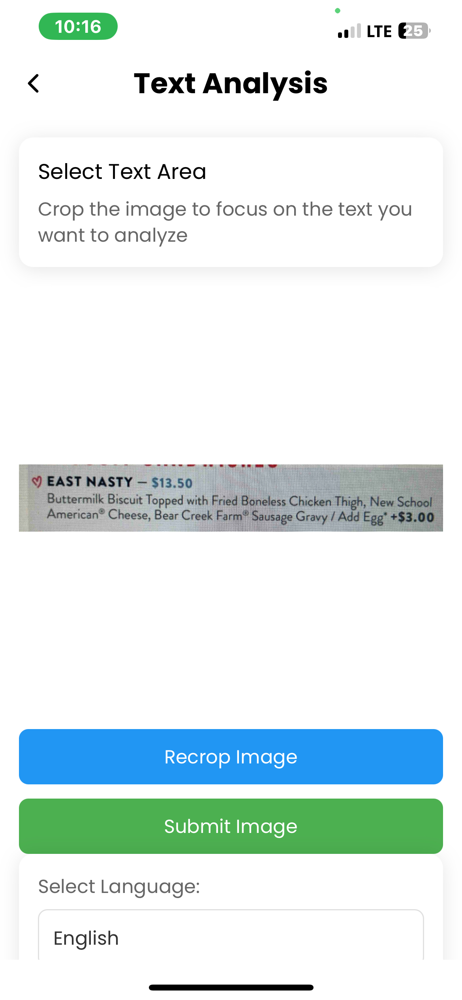
*Results from text-based allergen searches*

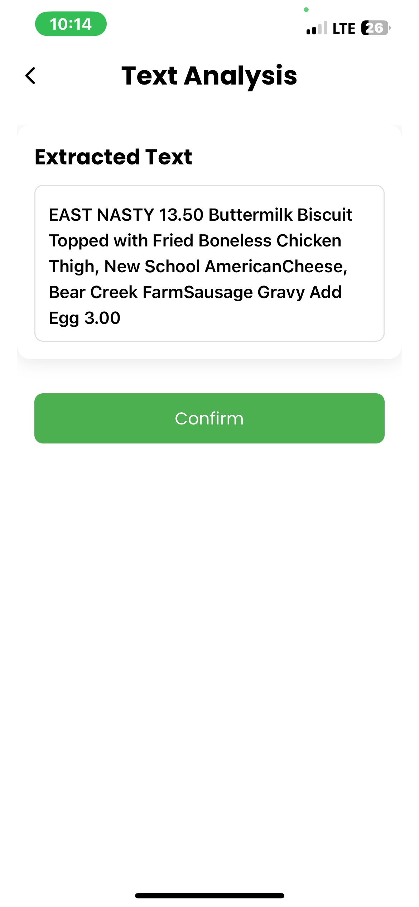
*Additional text input options and filters*

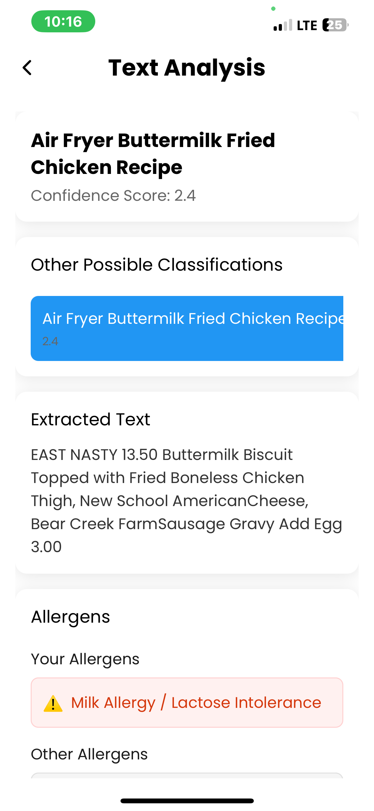
*Detailed view of text search results*

### Settings and Preferences
Customize your allergen preferences and app settings to get the most relevant information.

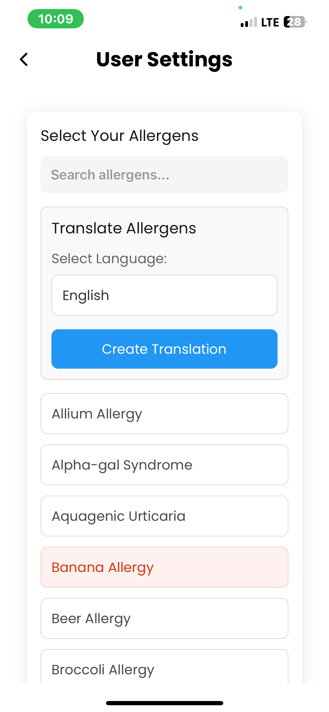
*Main settings menu for app configuration*

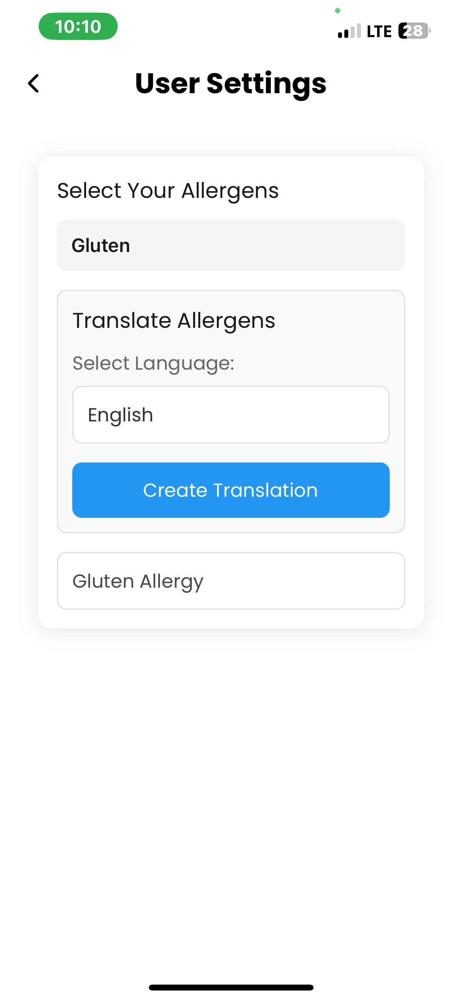
*Customize your allergen preferences*

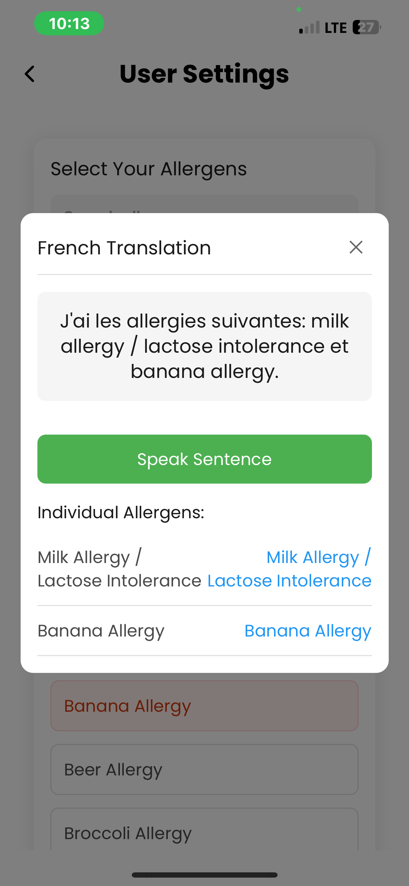
*Additional app settings and options*

### Leaving Feedback

You can leave a user review to recommend the app or give us feedback from the app store you downloaded it from.

## Troubleshooting

### Common Issues & Fixes
- **Image not recognized?** Ensure good lighting and a clear image of the item. Qsine is continually improving and may simply not have enough data to properly recognize your item. Please try again later.
- **Barcode not scanning?** Try again with a steady hand and proper focus.

## FAQ

### Is Qsine free to use?
Yes, Qsine is completely free to use.

### What allergens does Qsine detect?
Qsine supports major allergens like nuts, dairy, gluten, shellfish, and more. Users can customize their allergen preferences.

### Can I use Qsine without an internet connection?
Unfortunately no, analysis and database updates require an internet connection.

### How does QSine manage my data?
The only user data that is stored is the allergen profile that you may optionally manually fill out. Images may be stored to further training, but are anonymized.

### Is QSine safe to use?
QSine cannot guarantee with 100% accuracy that a dish is absent of an allergen. It's merely a guideline to let you know a dish likely does contain a given allergen.

### How is the name pronounced?
Q as in the letter Q, sine like the last part of cuisine.

