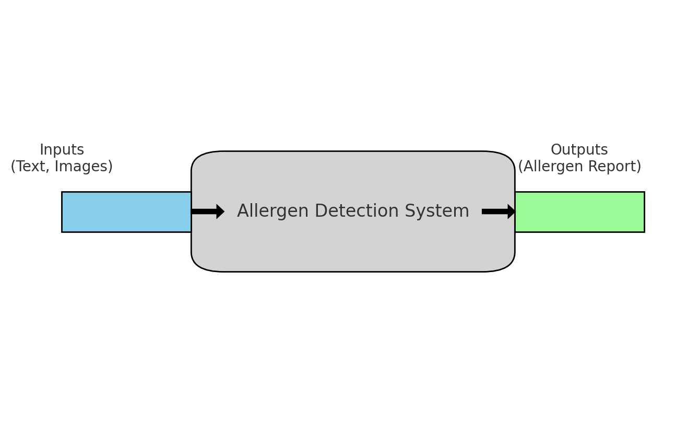
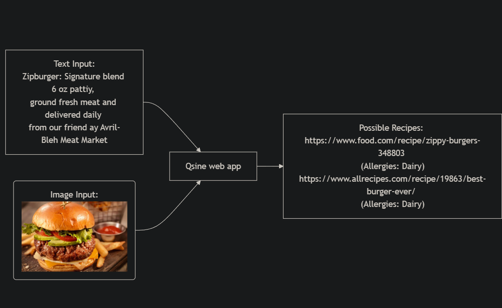
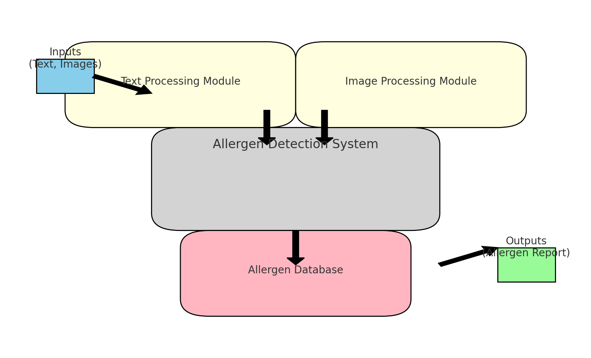
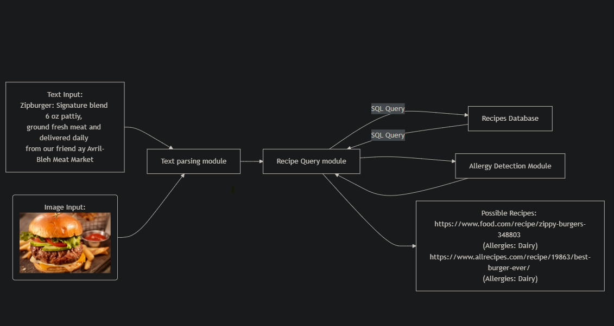
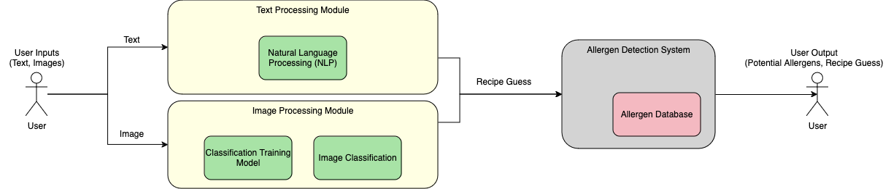

# Project Title: Allergen Detection System

## Goal Statement
The goal of this project is to develop a system that helps users identify potential allergens in various mediums, such as text and images, to ensure safe consumption for individuals with allergies. The system offers the ability to analyze menus, recipes, nutrition labels, and even images of food items to provide comprehensive allergen reports, offering peace of mind to users and caregivers.

---

## Design D0: High-Level View

### Description
Design D0 provides the highest-level view of the Allergen Detection System, highlighting the fundamental flow of data. Users provide inputs in the form of text (e.g., ingredient lists, menu descriptions) or images (e.g., photos of food items). The system processes these inputs to generate an allergen report, which indicates potential allergens found in the input data.

- **Inputs:** 
  - **Text:** Directly inputted text such as ingredients, recipes, or menus.
  - **Images:** Photographs of food items or labels that need to be analyzed for allergen content.
- **System:** 
  - The core "Allergen Detection System" processes these inputs using advanced text and image processing techniques to detect potential allergens.
- **Outputs:** 
  - An allergen report that identifies possible allergens and their aliases, helping users make safe dietary choices.

### Diagram

### Example

---

## Design D1: Elaborate Design of Subsystems

### Description
Design D1 delves deeper into the Allergen Detection System, outlining its core subsystems and their interactions. This design shows the Text Processing Module, the Image Processing Module, and the Allergen Database. It details how each subsystem handles specific types of input and collaborates to provide accurate allergen detection results.

- **Text Processing Module:**
  - **Functionality:** Receives and analyzes textual data to identify potential allergens.
  - **Process:** Utilizes Natural Language Processing (NLP) to parse text and extract relevant allergen information, including identifying aliases of common allergens.
- **Image Processing Module:**
  - **Functionality:** Receives image inputs and analyzes them to detect food items that may contain allergens.
  - **Process:** Uses computer vision techniques to identify text within images (e.g., labels, menus) and processes these using OCR.
- **Allergen Database:**
  - **Functionality:** Stores a comprehensive list of known allergens and their aliases.
  - **Interaction:** Both the Text and Image Processing Modules query this database to match detected terms or features with known allergens.

- **Workflow:** 
  1. Input data is fed into either the Text Processing or Image Processing Module.
  2. Extracted text or features are compared against the Allergen Database.
  3. An allergen report is generated based on the findings.

### Diagram

### Example

---

## Design D2: Detailed View of Subsystems

### Description
Design D2 provides an in-depth breakdown of each subsystem within the Allergen Detection System, outlining the internal components and their interactions. This design highlights how data flows through various stages of processing, from initial input through detailed analysis, leading to the generation of an allergen report.

- **Text Processing Module:**
  - **Optical Character Recognition (OCR):** 
    - Converts text from images into machine-encoded text.
    - Extracts ingredient lists or other textual data from images for further analysis.
  - **Natural Language Processing (NLP):**
    - Analyzes and interprets the extracted text.
    - Uses pattern recognition and keyword matching to identify potential allergens, considering various aliases and forms of allergens.
  
- **Image Processing Module:**
  - **Image Analysis:**
    - Analyzes the visual content of images to identify food items or packaging that may contain allergenic ingredients.
    - Uses machine learning models to recognize common allergenic foods.
  - **Allergen Detection:**
    - Matches the identified items against the Allergen Database to detect potential allergens.
    - Generates warning indicators based on the likelihood of allergen presence.
  
- **Allergen Database Interaction:**
  - Both modules query the Allergen Database to cross-reference detected text or visual features.
  - Returns results that include allergen names, severity, and potential cross-contamination warnings.

- **Error Handling and Feedback Loop:**
  - The system includes error handling for unclear images or ambiguous text.
  - Provides feedback to users to refine input if necessary, ensuring accurate detection.

- **Outputs:** 
  - A detailed allergen report with:
    - Identified allergens and their aliases.
    - Confidence levels for detected allergens.
    - Recommendations for users based on the analysis.

### Diagram

---

### Notes on Diagram Conventions
- **Boxes/Figures:** Represent different system components, subsystems, or processes.
- **Lines/Arrows:** Indicate the flow of data or control between components.
- **Icons / Colors:** 
  - Gray: Main System
  - Yellow: Subsystems
  - Green: Internal Processes Within Subsystems
  - Red: Database Interactions
  - Stick Figures: End User
