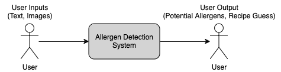
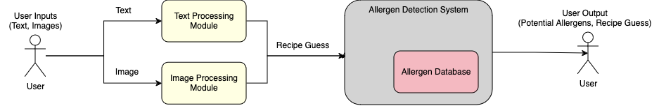
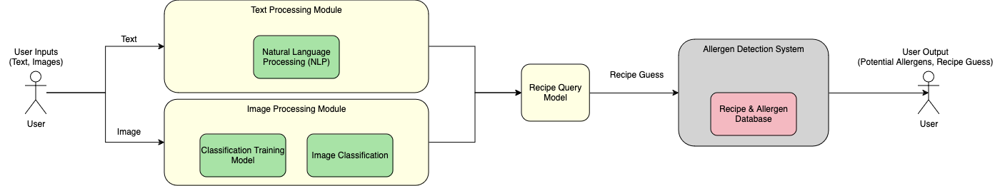

# Final Fall Design Report

Welcome to our Final Fall Design Report repository. This document outlines our project work in a professional and clear format, ensuring consistency and clarity throughout. Use the Table of Contents below to navigate to specific sections of the report.

## Table of Contents

1. [Team Names and Project Abstract](#team-names-and-project-abstract)
2. [Project Description](#project-description)
3. [User Stories and Design Diagrams](#user-stories-and-design-diagrams)  
    - [User Stories](#user-stories)  
    - [Design Diagrams](#design-diagrams)  
        - Level 0, Level 1, and Level 2 Diagrams  
        - Description of Diagrams  
4. [Project Tasks and Timeline](#project-tasks-and-timeline)  
    - [Task List](#task-list)  
    - [Timeline](#timeline)  
    - [Effort Matrix](#effort-matrix)  
5. [ABET Concerns Essay](#abet-concerns-essay)  
6. [PPT Slideshow](#ppt-slideshow)  
7. [Self-Assessment Essays](#self-assessment-essays)  
8. [Professional Biographies](#professional-biographies)  
9. [Budget](#budget)  
    - [Expenses to Date](#expenses-to-date)  
    - [Donated Items and Sources](#donated-items-and-sources)  
10. [Appendix](#appendix)  
    - [References and Citations](#references-and-citations)  
    - [Code Repositories](#code-repositories)  
    - [Meeting Notes](#meeting-notes)  
    - [Evidence of Effort](#evidence-of-effort)

---

## Team Names and Project Abstract

- **Team Name:** QSine
- **Advisor:** Professor Annexstein
- **Project Abstract:**  
  QSine is a machine learning application designed to enhance food safety for individuals with allergies. By leveraging advanced image recognition and natural language processing (NLP) models, the app identifies dishes and their associated allergens based on images or text descriptions. The system integrates seamlessly with a robust database of recipes and allergens, providing users with quick and reliable insights to make informed dining choices. Our project aims to deliver an accessible, efficient, and secure tool to improve the quality of life for individuals navigating food allergies.

[Full Page](./Assignments/Assignment2_Team_Formation_and_Project_Description/README.md)

---

## Project Description

QSine is a machine learning application designed to enhance food safety for individuals with allergies. By leveraging advanced image recognition and natural language processing (NLP) models, the app identifies dishes and their associated allergens based on images or text descriptions. The system integrates seamlessly with a robust database of recipes and allergens, providing users with quick and reliable insights to make informed dining choices. Our project aims to deliver an accessible, efficient, and secure tool to improve the quality of life for individuals navigating food allergies.

[Full Page](./Assignments/Assignment2_Team_Formation_and_Project_Description/README.md)

---

## User Stories and Design Diagrams

### User Stories

1. **As a person with food allergies,** I want to scan a menu for potential allergens so that I can confidently decide what to order without risking an allergic reaction.

2. **As a parent of a child with allergies,** I want to take a photo of a packaged food item and have the app identify any allergens so that I can ensure it's safe for my child to consume.

3. **As a caregiver,** I want to input a list of ingredients into the app to identify hidden allergens so that I can prepare meals that are safe for the person I care for.

4. **As a user with multiple allergies,** I want to be alerted to the presence of allergens and their aliases in recipes so that I can avoid unexpected allergic reactions.

5. **As a frequent traveler with food allergies,** I want to quickly analyze foreign menus for potential allergens using text or image input so that I can make safe dining choices in unfamiliar places.

[Full Page](./Assignments/Assignment4_Design_Diagrams/User_Stories.md)

### Design Diagrams

- **Level 0 Diagram:**

- **Level 1 Diagram:**

- **Level 2 Diagram:**

## Conventions and Description of Components

### Conventions

1. **Boxes/Figures:**
   - Represent distinct components, subsystems, or processes in the Allergen Detection System.
   - Differentiated by color to indicate their type or role within the system:
     - **Gray:** Represents the main system (e.g., Allergen Detection System).
     - **Yellow:** Highlights subsystems (e.g., Text Processing Module, Image Processing Module).
     - **Green:** Represents internal processes or operations within subsystems.
     - **Red:** Denotes interactions with external systems or databases (e.g., Allergen Database).
   - **Stick Figures:** Represent end users interacting with the system.

2. **Lines/Arrows:**
   - Show the flow of data or control between components.
   - Direction indicates the flow, starting from inputs and leading to outputs.

3. **Icons/Visual Markers:**
   - Specific icons (e.g., document icons for text, camera icons for images) visually represent input types.
   - Symbols for processing steps (e.g., gears for processing or database symbols) indicate system actions.

---

### Purpose of Each Component

1. **Text Input/Processing (Yellow)**
   - **Purpose:** Enables users to input text data, such as ingredient lists or menu descriptions, for allergen analysis.
   - **Details:** Utilizes NLP techniques to parse and extract relevant terms from the text for allergen detection.

2. **Image Input/Processing (Yellow)**
   - **Purpose:** Allows users to upload images (e.g., photos of food items, labels) for analysis.
   - **Details:** Combines OCR and image recognition to convert visual information into analyzable text and features.

3. **Optical Character Recognition (OCR) (Green)**
   - **Purpose:** Converts text from images into machine-readable text.
   - **Details:** Extracts ingredient lists or other relevant data embedded within images.

4. **Natural Language Processing (NLP) (Green)**
   - **Purpose:** Analyzes textual data (from text input or OCR output) to identify potential allergens.
   - **Details:** Uses keyword matching, pattern recognition, and context analysis to detect allergen-related terms.

5. **Image Analysis (Green)**
   - **Purpose:** Processes visual data to identify food items or packaging that may indicate allergens.
   - **Details:** Uses computer vision techniques to recognize allergenic food types and features.

6. **Allergen Database (Red)**
   - **Purpose:** Stores a comprehensive list of allergens, their aliases, and severity levels.
   - **Details:** Serves as the central reference for both text and image processing modules, ensuring accurate allergen detection.

7. **Allergen Detection (Green)**
   - **Purpose:** Matches extracted text or identified features against the database to detect allergens.
   - **Details:** Returns findings such as allergen names, aliases, and confidence levels.

8. **Feedback Loop (Green)**
   - **Purpose:** Handles unclear or ambiguous inputs by requesting better data from users.
   - **Details:** Improves accuracy by guiding users to provide more precise inputs.

9. **Error Handling (Green)**
   - **Purpose:** Manages cases where inputs are invalid or inconclusive.
   - **Details:** Provides messages to users, asking for corrections or additional inputs.

10. **End User (Stick Figure)**
    - **Purpose:** Represents the individual interacting with the system, either inputting data or reviewing results.
    - **Details:** Could be a person with allergies, a caregiver, or anyone needing allergen information.

11. **Outputs (Gray)**
    - **Purpose:** Displays the final allergen report to the user.
    - **Details:** Includes detected allergens, confidence levels, aliases, and recommendations.

[Full Page](./Assignments/Assignment4_Design_Diagrams/README.md)

---

## Project Tasks and Timeline

### Task List

#### Kaleb Bishop
- Contact Professor for Advisement
- Create App in Typescript
- Implement Web Scraper
- Design App
- Train Image Classification Model to Recognize Dishes from Images
- Ensure consistant performance regardless of platform
- Implement Camera Functionality into App

#### Matthew Bryant
- Build Recipes Database
- Populate Database and Rank Recipes
- Populate Allergens into Database
- Design Web Scraper
- Test Text Tokenizer Output Being Sent to Recipes Database
- Test NLP Model Output Being Sent to Recipes Database
- Test Recipes Database Making Web Scraping Requests

#### Eric Buffington
- Design and Implement Text Tokenizer
- Research Natural Language Processing Models
- Integrate NLP Model with Tokenizer
- Test Text Tokenizer Output Being Sent to Recipes Database
- Test NLP Model Output Being Sent to Recipes Database

#### Hung Nguyen
- Test Image Classification Model Output Being Sent to NLP Model
- Test Output on Typescript App Matching Proper Database Entry
- Test Recipes Database Returning Proper Allergen List
- Test Database Recipe data quality
- Design Allergen recipe detection model
- Integrate Allergen detection model with database
- Test App for performance, endurance and availability

[Full Page](./Assignments/Assignment5_Task_Lists/)

### Timeline

| Task                                                            | Start Date       | End Date         | Milestone                               |
|------------------------------------------------------------------|------------------|------------------|-----------------------------------------|
| Contact Professor for Advisement                                 | September 25, 2024 | September 29, 2024 | Project Setup & Initial Consultation    |
| Design App                                                       | January 29, 2025 | February 5, 2025 | App Design Completion                   |
| Create App in TypeScript                                         | January 29, 2025 | March 5, 2025    | App Design Completion                   |
| Build Recipes Database                                           | February 1, 2025 | February 12, 2025 | Database Build & Populate               |
| Populate Database and Rank Recipes                               | February 5, 2025 | February 19, 2025 | Database Build & Populate               |
| Design Web Scraper                                               | October 1, 2024   | October 20, 2024 | Web Scraper and NLP Integration         |
| Implement Web Scraper                                            | October 6, 2024   | October 20, 2024 | Web Scraper and NLP Integration         |
| Design & Implement Text Tokenizer                                | February 1, 2025 | February 19, 2025 | Web Scraper and NLP Integration         |
| Research Natural Language Processing Models                      | February 1, 2025 | February 19, 2025 | Web Scraper and NLP Integration         |
| Integrate NLP Model with Tokenizer                               | February 5, 2025 | February 19, 2025 | Web Scraper and NLP Integration         |
| Test Text Tokenizer Output Sent to Recipes Database              | February 12, 2025 | February 26, 2025 | Model Training & Testing                |
| Test NLP Model Output Sent to Recipes Database                   | February 12, 2025 | February 26, 2025 | Model Training & Testing                |
| Train Image Classification Model to Recognize Dishes from Images | February 12, 2025 | February 26, 2025 | Model Training & Testing                |
| Test Image Classification Model Output Sent to NLP Model         | February 12, 2025 | February 26, 2025 | Model Training & Testing                |
| Test Recipes Database Making Web Scraping Requests               | February 19, 2025 | March 5, 2025    | Allergen Detection Model Integration    |
| Test Output on TypeScript App Matching Proper Database Entry     | February 19, 2025 | March 5, 2025    | Allergen Detection Model Integration    |
| Populate Allergens into Database                                 | February 12, 2025 | March 5, 2025    | Allergen Detection Model Integration    |
| Design Allergen Recipe Detection Model                           | February 19, 2025 | March 5, 2025    | Allergen Detection Model Integration    |
| Integrate Allergen Detection Model with Database                 | February 19, 2025 | March 5, 2025    | Allergen Detection Model Integration    |
| Test Recipes Database Returning Proper Allergen List             | February 19, 2025 | March 5, 2025    | Allergen Detection Model Integration    |
| Implement Camera Functionality into App                          | February 19, 2025 | March 26, 2025   | Final Testing and Performance Optimization |
| Ensure Consistent Performance Across Platforms                   | February 19, 2025 | March 26, 2025   | Final Testing and Performance Optimization |
| Test App Performance, Endurance, and Availability                | March 5, 2025    | March 26, 2025   | Final Testing and Performance Optimization |
| Test Database Recipe Data Quality                                | March 5, 2025    | March 26, 2025   | Final Testing and Performance Optimization |

### Effort Matrix

| Task                                                            | Kaleb Bishop (%) | Matthew Bryant (%) | Eric Buffington (%) | Hung Nguyen (%) |
|------------------------------------------------------------------|------------------|--------------------|---------------------|-----------------|
| Contact Professor for Advisement                                 | 100              | 0                  | 0                   | 0               |
| Create App in TypeScript                                         | 80               | 0                  | 0                   | 20              |
| Implement Web Scraper                                            | 100              | 0                  | 0                   | 0               |
| Design App                                                       | 70               | 0                  | 0                   | 30              |
| Train Image Classification Model to Recognize Dishes from Images | 100              | 0                  | 0                   | 0               |
| Ensure Consistent Performance Across Platforms                   | 60               | 0                  | 0                   | 40              |
| Implement Camera Functionality into App                          | 80               | 0                  | 0                   | 20              |
| Build Recipes Database                                           | 0                | 100                | 0                   | 0               |
| Populate Database and Rank Recipes                               | 0                | 100                | 0                   | 0               |
| Populate Allergens into Database                                 | 0                | 100                | 0                   | 0               |
| Design Web Scraper                                               | 30               | 70                 | 0                   | 0               |
| Test Text Tokenizer Output Sent to Recipes Database              | 0                | 20                 | 40                  | 40              |
| Test NLP Model Output Sent to Recipes Database                   | 0                | 20                 | 40                  | 40              |
| Test Recipes Database Making Web Scraping Requests               | 0                | 40                 | 0                   | 60              |
| Design & Implement Text Tokenizer                                | 0                | 0                  | 100                 | 0               |
| Research Natural Language Processing Models                      | 0                | 0                  | 100                 | 0               |
| Integrate NLP Model with Tokenizer                               | 0                | 0                  | 100                 | 0               |
| Test Image Classification Model Output Sent to NLP Model         | 20               | 0                  | 0                   | 80              |
| Test Output on TypeScript App Matching Proper Database Entry     | 30               | 0                  | 0                   | 70              |
| Test Recipes Database Returning Proper Allergen List             | 0                | 30                 | 0                   | 70              |
| Design Allergen Recipe Detection Model                           | 0                | 0                  | 0                   | 100             |
| Integrate Allergen Detection Model with Database                 | 0                | 0                  | 0                   | 100             |
| Test App Performance, Endurance, and Availability                | 30               | 0                  | 0                   | 70              |
| Test Database Recipe Data Quality                                | 0                | 30                 | 0                   | 70              |

---

[Full Page](./Assignments/Assignment6_Milestones_Timeline_Effort_Matrix/README.md)

---

## ABET Concerns Essay
Our project is focused on training an artificial intelligence to be able to identify potential allergens in text or images and integrating it into an accessible form.  One constraint that we see is our economics where we are operating with a very small budget. We must rely on open-source tools such as TensorFlow but costly datasets, tools and computational power are out of our reach. This project also has implications on our professional development in that it requires the specialized skills in the realm of computer science such as machine learning, NLP, image processing, and full stack development.  If our end product is unable to reliably deliver correct results, it will reflect on the reputation of each of us team members.  Security considerations will also be a constraint given the sensitivity of dietary information. We must ensure that all personal information is not tradable back to an individual, that all data transfers are confidential and that all data is stored securely. The largest constraint we have is health due to the impact of incorrect results. Posting a false negative could result in the user consuming an item that can harm them. Furthermore, a bad actor may falsify the data to make allergic recipies appear as non-allergic. Thus, transparency is our strongest tool in giving users as much information as possible to guide their choices.

[Full Page](./Assignments/Assignment7_Project_Constraints_Essay/README.md)

---

## PPT Slideshow
[Link to PPT](./Assignments/Assignment8_Slide_Show_Fall_Design_Presentations/slide_deck.pptx)

[Link to Video](./Assignments/Assignment9_Presentation_Videos_and_Peer_Review_Assessments/slide_deck.mp4)

---

## Self-Assessment Essays

[Kaleb Bishop (bishopkw)](./Assignments/Assignment3_Team_Contract_and_Individual_Capstone_Assessment/Bishopkw.docx)

[Matthew Bryant (bryantmw)](./Assignments/Assignment3_Team_Contract_and_Individual_Capstone_Assessment/bryantmw.docx)

[Hung Nguyen (nguye3hv)](./Assignments/Assignment3_Team_Contract_and_Individual_Capstone_Assessment/nguye3hv.pdf)

[Eric Buffington (buffinea)](./Assignments/Assignment3_Team_Contract_and_Individual_Capstone_Assessment/buffinea.docx)

---

## Professional Biographies

[Kaleb Bishop (bishopkw)](./Assignments/Assignment1_Professional_Biography/Bishopkw.md)

[Matthew Bryant (bryantmw)](./Assignments/Assignment1_Professional_Biography/bryantmw.md)

[Hung Nguyen (nguye3hv)](./Assignments/Assignment1_Professional_Biography/nguye3hv.md)

[Eric Buffington (buffinea)](./Assignments/Assignment1_Professional_Biography/buffinea.docx)

---

## Budget

### Expenses to Date

- $0.12 Used for the ChatGPT api, this was used to classify recipies into categories. For example Caramelized Onion and Roasted Garlic Pasta would fall into th pasta category.

Future expenses may include hosing costs for our API and database.

### Donated Items and Sources

No donated items or sources as of now.

---

## Appendix

### Meeting Notes

[Include meeting notes from team discussions.]

### Evidence of Effort
#### Kaleb Bishop
- Created a draft frontend in react native, able to take in both text and image inputs.
- Designed and implemented a breadth first search web scraper for Allrecipies.com. This allows us to get large amounts of text data paired with image data. We can then use this data for our AI.
- Used the ChatGPT api in order to classify different images into categories.

---